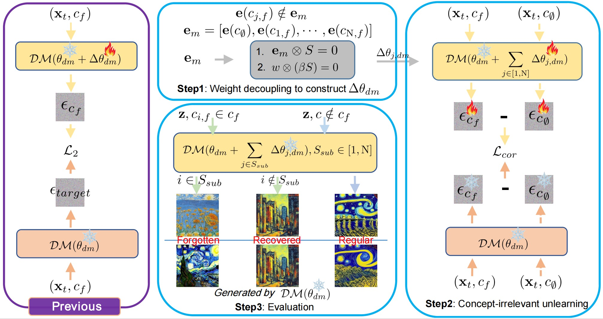

# [Forget All That Should Be Forgotten: Separable, Recoverable, and Sustainable Multi-Concept Erasure from Diffusion Models](https://github.com/Dlut-lab-zmn/SepCE4MU/blob/main/pdf/SRSME_CCS_430.pdf)
 
<div align='center'>

</div>

Issues: 
* affect the overall model performance when erasing concepts;
* overlook the challenges associated with iterative concept erasure and subsequent restoration.

* Concept restoration: The agreement breakdown between concept owners and DM owners may be temporary, and DM owners need to recover these forgotten concepts after regaining their copyrights.
* Multi-concept erasure: Current erasure procedures are confined to single-concept elimination and pose challenges when extending them to multi-concept erasure. Multi-concept erasure can take two forms: simultaneous erasure of multiple concepts and iterative concept erasure . The former encounters memory overload, while both forms involve interactions between fine-tuned weights for erasing various concepts.
* Model performance preservation: Prior efforts focus on concept erasure, leading to a considerable performance degradation in the overall generative capability of DMs. Particularly, they may destroy model watermarks, i.e., watermarks triggered by pre-defined prompts for text-guided DMs.


We propose 
* Weight Decoupling;
* Concept-irrelevant Unlearning;
* Optimization Decoulping.

In this project, we propose a novel Separable, Recoverable, and Sustainable Multi-concept Eraser (SRS-ME), enabling diffusion models to forget all concepts that they should forget without necessitating retraining from scratch.
Specifically, through theoretical analysis, we introduce the paradigm of weight decoupling for constructing separable weight shifts, which can decouple interactions among weight shifts targeting diverse concepts.
This approach also provides flexibility in both erasing and recovering arbitrary concepts while preserving model watermarks.
To effectively erase inappropriate concepts and preserve model performance on regular concepts, we design an innovative concept-irrelevant unlearning optimization process.
By defining concept representations, this process introduces the concept correlation loss and the momentum statistic-based stopping condition.
Besides, to reduce memory usage, we demonstrate the feasibility of optimization decoupling for separated weight shifts.
Benchmarked against prior work, extensive experiments demonstrate the flexibility of our SRS-ME in concept manipulation, as well as its efficacy in preserving model performance and reducing memory consumption.

## Fine-tuned Weights

We do not offer the fine-tuned weights for download, as the training process is faster.

## Installation Guide

* To get started clone the following repository of Original Stable Diffusion [Link](https://github.com/CompVis/stable-diffusion)
* Then replace the files from our repository (ldm-replace.txt) to `stable-diffusion` main directory of stable diffusion. 
* Download the weights from [here](https://huggingface.co/CompVis/stable-diffusion-v-1-4-original/resolve/main/sd-v1-4-full-ema.ckpt) and move them to `stable-diffusion/models/ldm/`
* [Only for training] To convert your trained models to diffusers download the diffusers Unet config from [here](https://huggingface.co/CompVis/stable-diffusion-v1-4/blob/main/unet/config.json)

## Training Guide

After installation, follow these instructions to train a machine unlearning model:

1. Generate data and then put these samples to `./data/train/{0,1,2,3,4,5,6,7,8,9}` or `./data/eval/{0,1,2,3,4,5,6,7,8,9}`

* `python eval-scripts/generate-data.py --prompt 'Van Gogh' --model_name '0' --save_path './data/' --num_samples 1 --device 'cuda:0'`

`--prompt` can be `Van Gogh`, `Picasso`, `Cezanne`, `Jackson Pollock`, `Caravaggio`, `Keith Haring`, `Kelly McKernan`, `Tyler Edlin`, and `Kilian Eng`.

2. Train classification model 
* `python train-scripts/artist-cls-train.py --device 'cuda:0'`

3. Train FMN, Abconcept, Esd, CiE, SepCE
* `python train-scripts/FMN.py --lr 1e-5 --iter_break 10 --prompt 'Van Gogh' --devices '0,1'`
* `python train-scripts/Abconcept.py --lr 1e-5 --iter_break 50 --prompt 'Van Gogh' --devices '0,1'`
* `python train-scripts/Esd.py --prompt 'Van Gogh' --train_method 'xattn' --iterations 1000 --devices '0,1'`
* `python train-scripts/CiE.py --threshold 0 --lr 1e-6 --reg_beta 3e-5 --prompt 'Van Gogh' --devices '0,1'`
* `python train-scripts/SepCE.py --lr 1e-2 --scale_factor 1e-4 --reg_beta 3e-5 --devices '0,1'`

## Generating Images

To generate images from one of the custom models use the following instructions:

* To use `eval-scripts/generate-images.py` you would need a csv file with columns `prompt`, `evaluation_seed` and `case_number`. (Sample data in `data/`)
* evaluate.csv: We randomly select 50 seeds for each style and generate 5 images (`num_samples`) using trained DMs per seed. 
* `python eval-scripts/generate-images.py --model_name='?' --prompts_path './data/evaluate.csv' --save_path 'evaluation_folder' --num_samples 5`


To obtain the quantitative results:

* Rename the dir_name of generated images to `eval`,
* `python train-scripts/move_image.py`
* `python train-scripts/artist-cls-test.py --path './evaluation_folder/'`
* The `default` contains the images generated by the original diffusion model; The `eval` contains the images generated by the unlearned diffusion model
* `python eval-scripts/lpips_eval.py --original_path './evaluation_folder/default' --edited_path './evaluation_folder/eval' --prompts_path './data/evaluate.csv'`
## Citing our work
If you find our work valuable, please consider citing the preprint using the following format:
```
```
